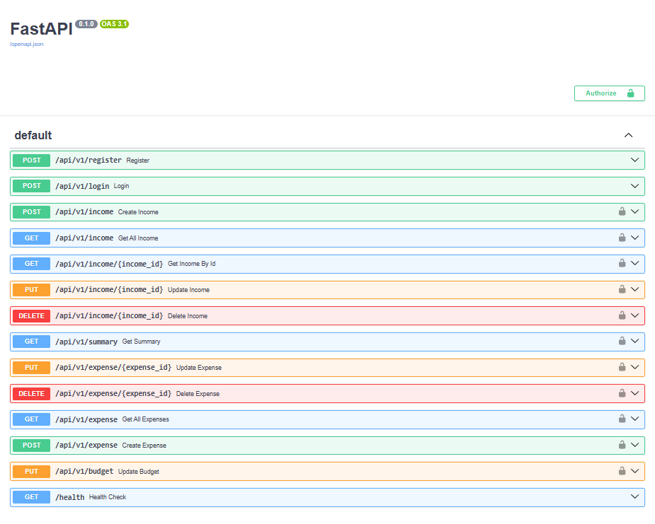

# Finance API

A personal finance REST API built with FastAPI for user authentication, income tracking, expense tracking, budgeting, and financial summaries.

## Features

* User registration and login with JWT authentication
* Income tracking
* Expense tracking
* Budget management
* Financial summaries
* API documentation with Swagger UI

## Tech Stack

* Python
* FastAPI
* SQLAlchemy
* SQLite
* JWT Authentication
* Docker

## Live Demo

* API: https://finance-api-5ydp.onrender.com
* Docs: https://finance-api-5ydp.onrender.com/docs

## API Documentation



## Architecture

## Architecture

- **Frontend** – Dashboard / Web App  
- **Backend** – FastAPI API server  
- **Authentication** – JWT tokens  

## API Endpoints

POST /register – Create user account  
POST /login – Authenticate user and return JWT token  

GET /income – View income records  
POST /income – Add income  

GET /expenses – View expenses  
POST /expenses – Add expense  

GET /summary – Financial summary

### Routes
- Income tracking
- Expense tracking
- Budget management
- Financial summaries  

- **Database** – SQLite with SQLAlchemy ORM
  
## Project Structure

```
routers/
models/
schemas/
tests/
main.py
database.py
security.py
```

## Running Locally

```bash
git clone https://github.com/Gabriel-mock/Finance-api.git
cd Finance-api
pip install -r requirements.txt
uvicorn main:app --reload
```

## Future Improvements

* Add categories for income and expenses
* Add charts and analytics endpoints
* Improve test coverage
* Add PostgreSQL support
